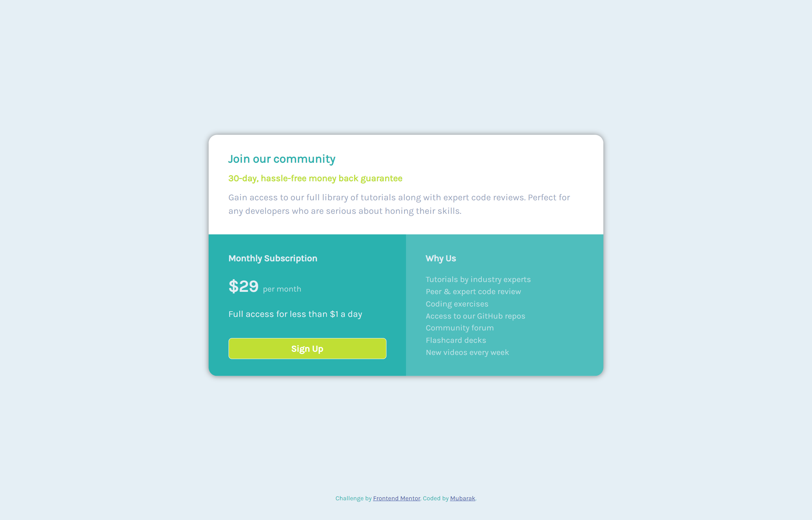

# Frontend Mentor - Single price grid component solution 

## Table of contents

- [Overview](#overview)
  - [The challenge](#the-challenge)
  - [Screenshot](#screenshot)
  - [Links](#links)
- [My process](#my-process)
  - [Built with](#built-with)
  - [What I learned](#what-i-learned)
  - [Useful resources](#useful-resources)
- [Author](#author)

## Overview

This is a solution to the [Single price grid component challenge on Frontend Mentor](https://www.frontendmentor.io/challenges/single-price-grid-component-5ce41129d0ff452fec5abbbc). Frontend Mentor challenges help you improve your coding skills by building realistic projects.

### The challenge

Users should be able to:

- View the optimal layout for the component depending on their device's screen size
- See a hover state on desktop for the Sign Up call-to-action

### Screenshot




### Links

- Solution URL: [Solution](https://your-solution-url.com)
- Live Site URL: [Live site](https://your-live-site-url.com)

## My process

### Built with

- Semantic HTML5 markup
- CSS custom properties
- Flexbox
- Mobile-first workflow
- [Bootstrap](https://getbootstrap.com/) - CSS library

### What I learned

Power of max-width, min-height and overflow

```css
body {
    background-color: hsl(204, 43%, 93%);
    color: hsl(204, 43%, 93%);
    display: flex;
    min-height: 100vh;
    flex-direction: column;
    justify-content: center;
    font-size: 16px;
    font-family: 'Karla';
    font-weight: 400;
    padding: 30px 0;
}
```
```css
.rounded-container {
      max-width: 700px;
      border-radius: 15px;
      overflow: hidden;
      box-shadow: 0 0 10px grey;
}
```

### Useful resources

- [W3 school](https://www.w3schools.com/) - This helped me to understand how to use fonts in my design using url.
- [W3 school](https://www.w3schools.com/) - It also helped me to know how to use overflow.

## Author
- Frontend Mentor - [@Freedteck](https://www.frontendmentor.io/profile/Freedteck)